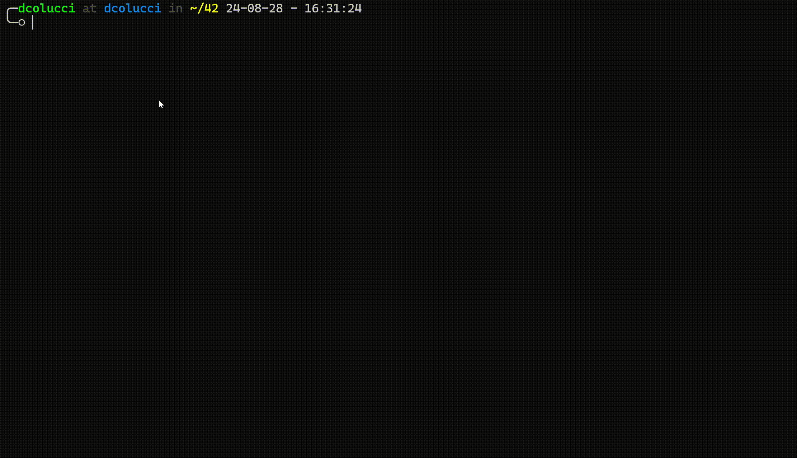

# Minishell
As beautiful as a shell

## Table of Contents
- [Overview](#overview)
- [Requirements of the project](#requirements-and-guidelines-of-42-school)
- [Installation](#installation)
- [Usage](#usage)
- [Key Features](#key-features)
- [Authors](#authors)

## Overview
Minishell is a BASH shell implementation written in C, adhering to strict guidelines and best practices of [42 school](https://42firenze.it/). It aims to replicate the functionalities of a basic shell environment, providing users with a command prompt, history management, command execution, and various built-in functionalities.

## Requirements and Guidelines of 42 school

- The project must be written in C and comply with the provided Norm standards.
- Memory management is crucial, and all dynamically allocated memory must be properly freed to prevent memory leaks.
- A Makefile must be included, supporting compilation with specified flags and rules.
- Submission should include required files such as Makefile, header files, and C source files.
- The project should adhere strictly to the specified functionalities and avoid unnecessary additions.

For a more complete overview take a look at the [subject](./minishell.en.subject.pdf)

## Installation
1. Clone the repository:
```bash
 git clone https://github.com/Coluyanson/minishell.git
```

2. Install dependencies:
```bash
 sudo apt-get install libreadline-dev
```

## Usage
To run the project, use the following command:
```bash
cd minishell
make
./minishell
```


## Key Features

- **Command Prompt**: Minishell presents users with a prompt where they can enter commands.
- **History Management**: Users can access previously executed commands and navigate through command history.
- **Command Execution**: Minishell locates and executes the appropriate executable files based on the PATH variable or specified paths.
- **Signal Handling**: Minishell manages signals efficiently, using only one global variable to indicate received signals, ensuring data integrity and reliability.
- **Input Handling**: Minishell interprets quotes, handles special characters, and implements redirections and pipes.
- **Environment Variables**: Minishell expands environment variables, allowing users to access and manipulate system environment settings.
- **Built-in Commands**: Minishell supports essential built-in commands such as `echo`, `cd`, `pwd`, `export`, `unset`, `env`, and `exit`.

## Authors

- [dcolucci](https://github.com/Coluyanson)
- [vguidoni](https://github.com/Rotkiv97)
